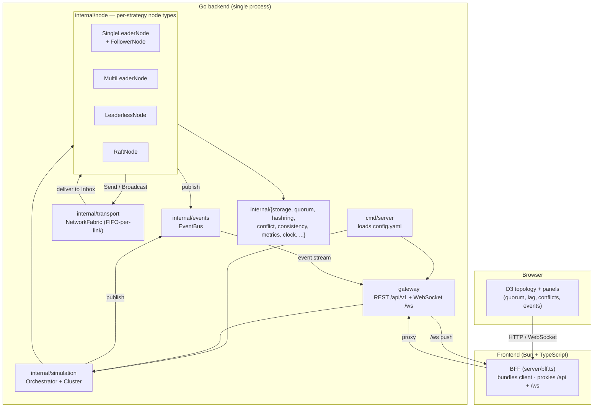
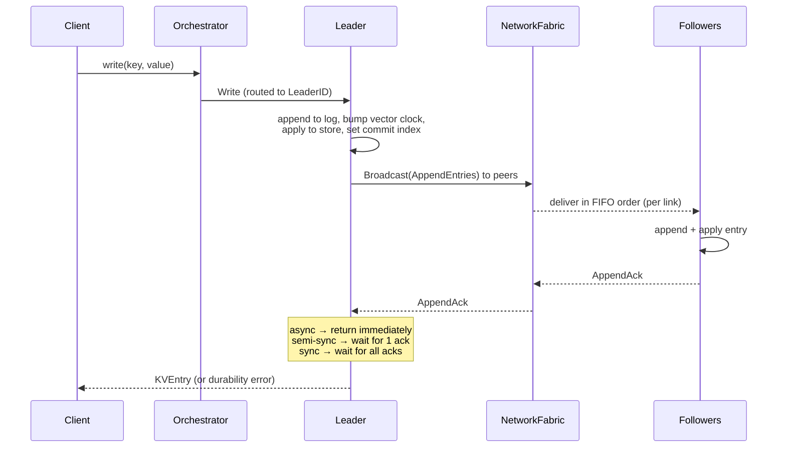
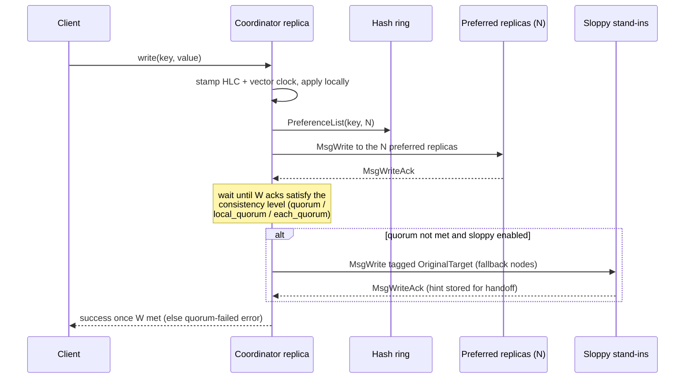
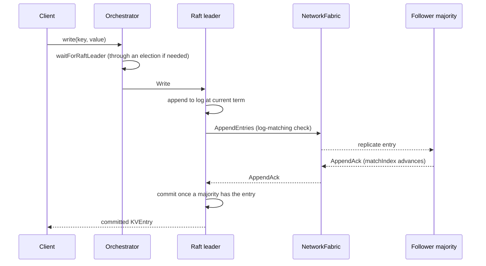

# Architecture

This document describes the components of the Replication Strategies simulator and how
a write flows through each of the three main replication strategies. It is meant to be
read alongside the code in [`internal/`](../internal), the entrypoint in
[`cmd/server`](../cmd/server), and the [`gateway`](../gateway) package.

## Overview

The system is a single Go process that hosts one or more **simulated clusters**. Each
cluster is a set of in-memory nodes wired together by an in-process **network fabric**
that models latency, jitter, packet loss, and partitions. A REST + WebSocket
**gateway** drives the simulation, and a Bun/TypeScript **frontend** (served through a
BFF proxy) visualizes it with D3.

## Components

### `cmd/server`

The entrypoint. It loads [`config.yaml`](../config.yaml), constructs an
[`events.EventBus`](../internal/events/bus.go), an
[`simulation.Orchestrator`](../internal/simulation/orchestrator.go), and the
[`gateway.Server`](../gateway/server.go), then serves HTTP on the configured port
(default `8080`) with graceful shutdown on `SIGINT`/`SIGTERM`.

### `gateway`

A [chi](https://github.com/go-chi/chi) router exposing the REST API under `/api/v1`
and an event-stream WebSocket at `/ws`. It translates HTTP requests into orchestrator
calls — creating clusters, issuing writes/reads/deletes, injecting network faults,
running scenarios and correctness checkers — and streams `EventBus` events to
connected clients. See [`gateway/server.go`](../gateway/server.go) for the full route
table.

### `internal/simulation` — Orchestrator

The [`Orchestrator`](../internal/simulation/orchestrator.go) owns the lifecycle of
every `Cluster`. `CreateCluster` builds the strategy-appropriate set of nodes
(`createSingleLeaderCluster`, `createMultiLeaderCluster`, `createLeaderlessCluster`,
`createRaftCluster`), assigns regions, wires them to a fresh
`transport.NetworkFabric`, and starts them. It also routes client operations to the
right target node (e.g. the leader for single-leader, the elected Raft leader via
`waitForRaftLeader`) and records each op into a linearizability `History` for the
correctness checker.

### `internal/node` — strategy node types

All node types implement the [`node.Node`](../internal/node/node.go) interface
(`Write`, `Read`, `Delete`, `Start`, `Pause`, `HandleMessage`, `Inbox`, …) and embed a
shared [`BaseNode`](../internal/node/base.go) that provides identity, peer tracking,
the KV store, the replication log, metrics, a hybrid logical clock (HLC), and
pause/resume state. Each type runs its own goroutine message loop draining messages the
fabric delivers to its inbox:

- **`SingleLeaderNode`** + **`FollowerNode`** — one leader accepts writes and
  replicates an `AppendEntries` log to followers; the leader honors async / sync /
  semi-sync durability (`awaitReplication`), and lagging followers catch up via `MsgSync`.
- **`MultiLeaderNode`** — every node accepts writes; concurrent writes are detected
  with vector clocks and reconciled by a pluggable `conflict.ConflictResolver`
  (LWW / vector-clock / CRDT / manual).
- **`LeaderlessNode`** — Dynamo-style tunable `N/W/R` quorums with consistent-hash
  preference-list routing, sloppy quorums + hinted handoff, and async/sync/digest read
  repair (see [`internal/node/leaderless.go`](../internal/node/leaderless.go)).
- **`RaftNode`** — real leader election, log-matching `AppendEntries`, majority commit,
  automatic failover, and log compaction with snapshots.

### `internal/transport` — network fabric

The [`NetworkFabric`](../internal/transport/fabric.go) is the simulated network. Nodes
`Register` an inbox channel and `Send`/`Broadcast` `Message`s through it. The fabric
applies per-link latency (fixed or a jittered heavy-tail distribution), packet-drop
probability, and partitions. Crucially it maintains a **FIFO-per-link** delivery model:
each `(source → target)` pair has its own queue drained by a single worker goroutine,
with delivery times clamped monotonically so a later message can never overtake an
earlier one on the same link — a property single-leader log replication depends on.
See [ADR 0002](adr/0002-replication-strategy-node-model.md) for the rationale.

### Supporting packages

`internal/storage` (KV store, vector clocks, log entries), `internal/quorum` (N/W/R
math), `internal/hashring` (consistent hashing + preference lists),
`internal/conflict` (LWW / vector-clock / CRDT / RGA resolvers), `internal/consistency`
(read-your-writes, monotonic, causal, bounded-staleness), `internal/metrics`,
`internal/clock` (HLC), `internal/failure` (phi-accrual detector), and the correctness
tooling in `internal/checker` (linearizability) and `internal/antientropy` (Merkle).

### Frontend

`frontend/server/bff.ts` is an Elysia (Bun) BFF that bundles the browser client from
`frontend/src`, serves it on port `3001`, and reverse-proxies `/api/*` and `/ws` to the
Go backend. The browser renders a live D3 topology and panels fed by the WebSocket
event stream.

## Data flow of a write

Every client write enters through `POST /api/v1/clusters/{id}/write`, which calls
`Orchestrator.Write`. From there the path diverges by strategy.

### Single-leader

The write is always committed locally on the leader; the replication *mode* only
governs how long the leader waits for follower acks before responding
(`awaitReplication` in [`leader.go`](../internal/node/leader.go)). A follower that fell
behind requests missing entries with `MsgSync` and the leader resends its log tail.

### Leaderless (quorum)

Placement is by consistent hashing: a key's replicas are the `N` distinct nodes walking
clockwise from the key's hash (`hashring.PreferenceList`), not "every node". If the
preferred replicas can't form a quorum (partition/down), a **sloppy quorum** borrows
healthy fallback nodes past the preference list, each tagged with the `OriginalTarget`
it stands in for; a background **hinted-handoff** loop delivers those entries once the
intended replica recovers. Reads fan out to `R` replicas, reconcile by
`(timestamp, nodeID)` last-write-wins order, and issue async/sync/digest **read repair**
to stale responders. Because `W + R > N`, a read quorum always intersects the latest
write quorum. See [ADR 0003](adr/0003-consistent-hashing-and-quorums.md).

### Raft (consensus)

Writes only succeed on the elected leader. `Orchestrator.waitForRaftLeader` resolves
the current online leader (briefly waiting through an election), the leader appends the
entry at its current term and replicates via `AppendEntries` with the log-matching
consistency check, and the entry commits once a **majority** of nodes have it. If the
leader is paused/partitioned, a follower times out, starts an election, and a new
leader takes over automatically. Lagging followers that have fallen behind a compacted
log are caught up with `InstallSnapshot`.

## Events and observability

Nodes and the orchestrator publish typed events (`EvtWriteReceived`,
`EvtQuorumAchieved`, `EvtReadRepair`, `EvtHintedHandoff`, `EvtPartitionCreated`, …) to
the `EventBus`. The gateway streams these over `/ws` to the frontend, which animates
the topology and updates its panels in real time. Per-node and per-cluster metrics
(`internal/metrics`) back the latency/throughput/lag views.
