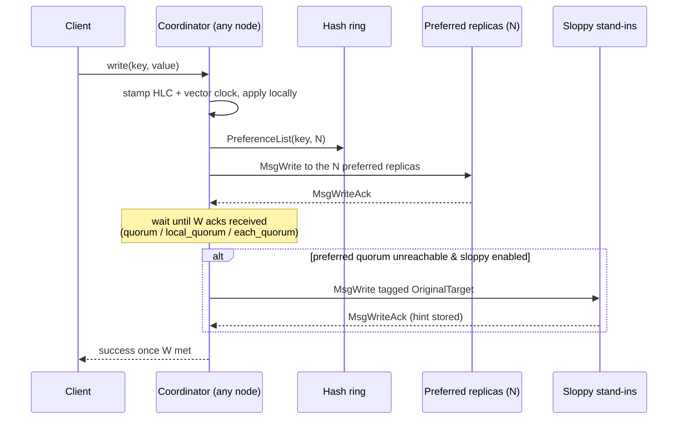

# Leaderless (Dynamo-Style) Replication

No single node is special. Every node can act as a **coordinator** for any request,
routing it to the appropriate replicas via a consistent-hash ring. Consistency is
controlled by tuning the quorum parameters `N`, `W`, and `R`.

---

## Consistent hashing and preference lists

Keys are not stored on every node. Instead, a **consistent hash ring** determines
which `N` nodes are responsible for each key:

1. Each physical node owns 128 virtual tokens placed uniformly on a hash ring.
2. `PreferenceList(key, N)` walks the ring clockwise from the key's hash and returns
   the first `N` distinct physical nodes — the key's **replica set**.
3. Virtual nodes keep placement balanced as the cluster size changes, and a membership
   change (add/remove node) only migrates a fraction of keys.

---

## Write path

---

## Quorum math

The fundamental guarantee: `W + R > N` means **any read quorum intersects any write
quorum** — you are always guaranteed to see at least one copy of the latest write.

| Configuration | W+R vs N | Guarantee |
|--------------|---------|-----------|
| N=5, W=3, R=3 | 6 > 5 | Strong consistency — always reads latest write |
| N=5, W=2, R=2 | 4 < 5 | Eventual consistency — may read stale data |
| N=5, W=5, R=1 | 6 > 5 | Write-optimized strong consistency |
| N=5, W=1, R=5 | 6 > 5 | Read-optimized strong consistency |

The UI's **Quorum** panel shows the current overlap count and whether the configuration
satisfies `W + R > N`. The `replsim check` CLI command prints the stale-read probability
for eventually-consistent configurations.

---

## Sloppy quorums and hinted handoff

When the preferred `N` replicas can't form the write quorum `W` (due to a partition or
node failure), the coordinator borrows **fallback nodes** further along the ring:

1. Each borrowed node stores the write tagged with the `OriginalTarget` it stands in for.
2. A background **hinted-handoff** loop monitors for the original target to recover.
3. Once recovered, the hint is replayed to the original target and deleted from the
   stand-in.

This keeps writes succeeding during transient failures while eventually restoring
the preferred placement.

---

## Read repair

Reads fan out to `R` replicas. When the responses disagree (different values or vector
clocks), the coordinator:

1. Returns the **winner** (highest `(timestamp, nodeID)` LWW order) to the client.
2. Issues a **repair** to the stale replicas:

| Repair mode | Behaviour |
|------------|-----------|
| `async` | Fire-and-forget repair in a background goroutine |
| `sync` | Wait for repair acknowledgements before returning to client |
| `digest` | Send only the winning hash; replica fetches full value only if it differs |

---

## Region-aware consistency levels

For geo-replicated clusters (configured with `regions` and `inter_region_latency_ms`),
three consistency levels are available:

| Level | Behaviour |
|-------|-----------|
| `quorum` | `ceil((N+1)/2)` acks from any nodes |
| `local_quorum` | Quorum within the coordinator's own region |
| `each_quorum` | Quorum in every region — strongest cross-region guarantee |

---

## What to try in the simulator

1. Create a `leaderless` cluster with 5 nodes, W=3, R=3 (strong consistency).
2. Write several keys and observe the preference-list routing in the topology.
3. Partition 2 of the 5 preferred nodes for a key and attempt a write. With sloppy
   quorums on, it succeeds using fallback nodes (watch for "hinted handoff" events).
4. Heal the partition and run `POST /anti-entropy` to sync.
5. Change to W=2, R=2 (eventual consistency). Write on one side of a partition,
   read from the other — observe a stale read.
6. Set `read_repair_mode: sync` and repeat: reads now self-heal.

---

## Real-world analogues

| System | Notes |
|--------|-------|
| Apache Cassandra | Tunable consistency; `LOCAL_QUORUM` / `EACH_QUORUM` |
| Amazon DynamoDB | Eventual or strongly-consistent reads; sloppy quorums internally |
| Riak | Dynamo-style N/W/R with CRDTs for convergence |
| Voldemort (LinkedIn) | Direct Dynamo port with pluggable serialization |
