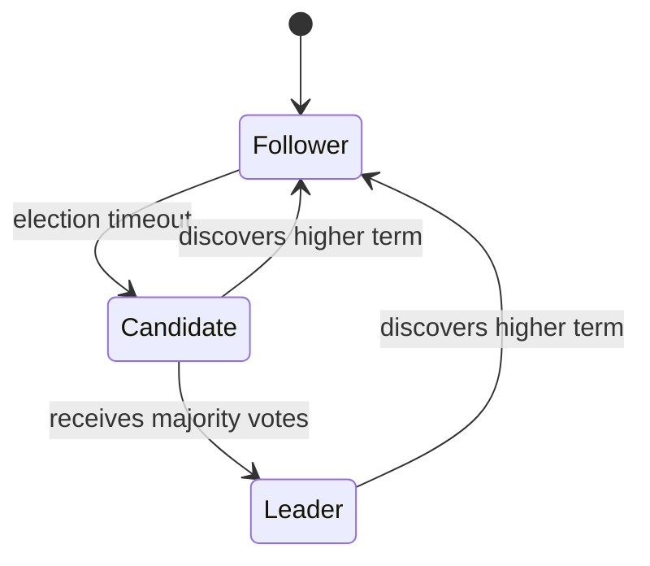
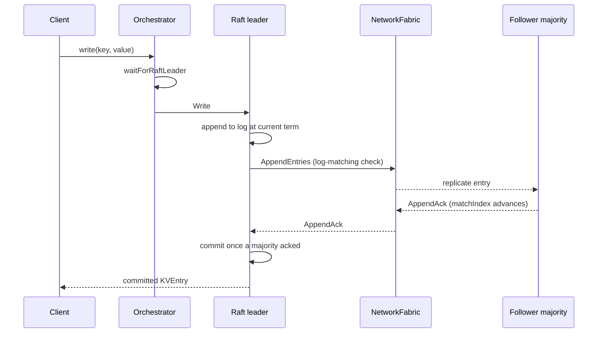

# Raft (Consensus)

Raft is a **consensus algorithm** designed to be understandable. It elects a single
leader per term, replicates an ordered log to a majority of followers, and only commits
entries once a majority has persisted them — guaranteeing linearizability.

---

## Leader election

Each node starts as a **follower**. When a follower's **election timeout** fires without
hearing from a leader, it increments its term, becomes a **candidate**, and broadcasts
`RequestVote` RPCs. A candidate wins if it receives votes from a majority of nodes
(including itself). The first candidate to reach majority wins; the election restarts if
no candidate wins before the next timeout fires.

Key properties:
- **At most one leader per term** — a candidate can only win if it receives a majority,
  and each node votes at most once per term.
- **Leader completeness** — a candidate only wins if its log is at least as up-to-date
  as a majority of nodes, preventing log loss.

---

## Log replication

The **log-matching property**: if two logs share an entry at the same index and term,
all preceding entries are identical. `AppendEntries` carries `prevLogIndex` and
`prevLogTerm` to enforce this — a follower rejects entries that don't match its current
log tail, and the leader backs up to find the last common entry.

---

## Majority commit

An entry is **committed** once the leader knows a majority of nodes have appended it.
Only committed entries are applied to the state machine (the KV store). The commit
index is piggybacked on subsequent `AppendEntries` so followers advance their own
commit index.

**Fault tolerance:** a cluster of `2f+1` nodes can tolerate `f` simultaneous failures
and still commit entries (because `f+1` remaining nodes form a majority).

| Cluster size | Tolerated failures | Required for commit |
|:-----------:|:------------------:|:-------------------:|
| 3 | 1 | 2 |
| 5 | 2 | 3 |
| 7 | 3 | 4 |

---

## Log compaction and snapshots

Once the log grows large enough, the leader takes a **snapshot** — a point-in-time
serialized copy of the KV store at a specific log index — and discards older log
entries. Followers that have fallen so far behind that the leader no longer has the
entries they need receive an `InstallSnapshot` RPC to catch up directly from the
snapshot rather than replaying the full log.

---

## What to try in the simulator

1. Create a `raft` cluster with 5 nodes. Observe the election in the Events panel —
   one node becomes leader within a few hundred milliseconds.
2. Write keys and verify they commit — all 5 nodes will show the entry in their logs.
3. **Pause the leader**. Watch the remaining 4 nodes time out and elect a new leader.
   The cluster continues serving writes once the new leader is elected.
4. Resume the old leader — it discovers the higher term, steps down, and catches up.
5. Pause **2 of 5 nodes** (minority). The remaining 3 still form a majority and keep
   committing.
6. Pause **3 of 5 nodes** (majority). The remaining 2 cannot form a majority — writes
   stall (CAP: Raft sacrifices availability to maintain consistency).

---

## Real-world analogues

| System | Notes |
|--------|-------|
| etcd | Reference Raft implementation; powers Kubernetes |
| CockroachDB | Multi-Raft (one Raft group per key range) |
| TiKV | Multi-Raft storage layer for TiDB |
| HashiCorp Consul | Raft for leader election and KV store |
| ScyllaDB | Raft for schema changes and LWT |
