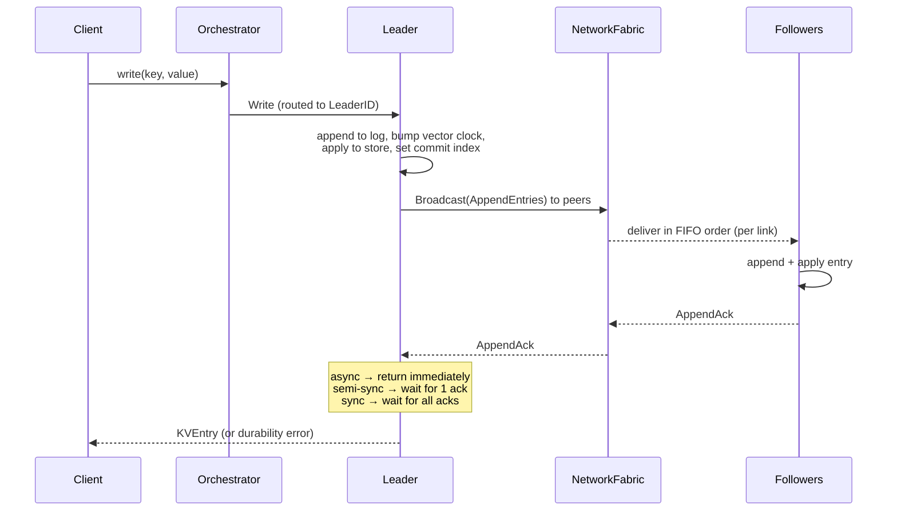

# Single-Leader Replication

One node is designated **leader** and accepts all writes. Followers receive a
replicated append-entries log and apply entries in order.

---

## Data flow



---

## Durability modes

The replication *mode* controls how long the leader waits for follower acknowledgements
before responding to the client. It does **not** affect whether the write is committed
locally on the leader — that always happens first.

| Mode | Wait condition | Latency | Durability |
|------|---------------|---------|------------|
| `async` | Return immediately after local commit | Lowest | Lowest — acknowledged data can be lost if leader crashes before replication |
| `semi-sync` | Wait for 1 follower ack | Medium | One replica guaranteed — tolerate 1 crash |
| `sync` | Wait for all followers to ack | Highest | All replicas guaranteed — no data loss on any single crash |

Toggle the mode live in the UI with the **Config** panel or via:

```bash
curl -X PATCH localhost:8080/api/v1/clusters/{id}/config \
  -H 'Content-Type: application/json' \
  -d '{"replication_mode": "semi-sync"}'
```

---

## Follower lag and catch-up

Followers that fall behind (due to packet loss, pause, or a simulated partition) detect
the gap via `AppendEntries` sequence numbers and send a `MsgSync` request. The leader
resends its log tail from the follower's last known index.

The **Lag** panel in the UI shows per-follower replication lag in milliseconds. Inject
a partition between the leader and one follower to watch lag grow, then heal the
partition to see catch-up.

---

## What to try in the simulator

1. Create a `single_leader` cluster with 4 nodes.
2. Write several keys and observe the topology — all writes flow through the leader.
3. Switch from `async` to `sync` mode and write again; notice the increased latency.
4. **Pause a follower** and write more keys. Observe lag in the metrics panel.
5. Resume the follower and watch it catch up via `MsgSync`.
6. **Pause the leader**. With async mode the cluster stalls (no automatic failover in
   single-leader mode — unlike Raft). Resume and verify no data was lost.

---

## Real-world analogues

| System | Mechanism |
|--------|-----------|
| PostgreSQL streaming replication | WAL shipping; `synchronous_standby_names` for sync |
| MySQL replication | Binlog replication; semi-sync plugin |
| Apache Kafka | Leader + ISR (in-sync replicas); `acks=all` for sync |
| Redis Replication | Async by default; `WAIT` for semi-sync behaviour |
